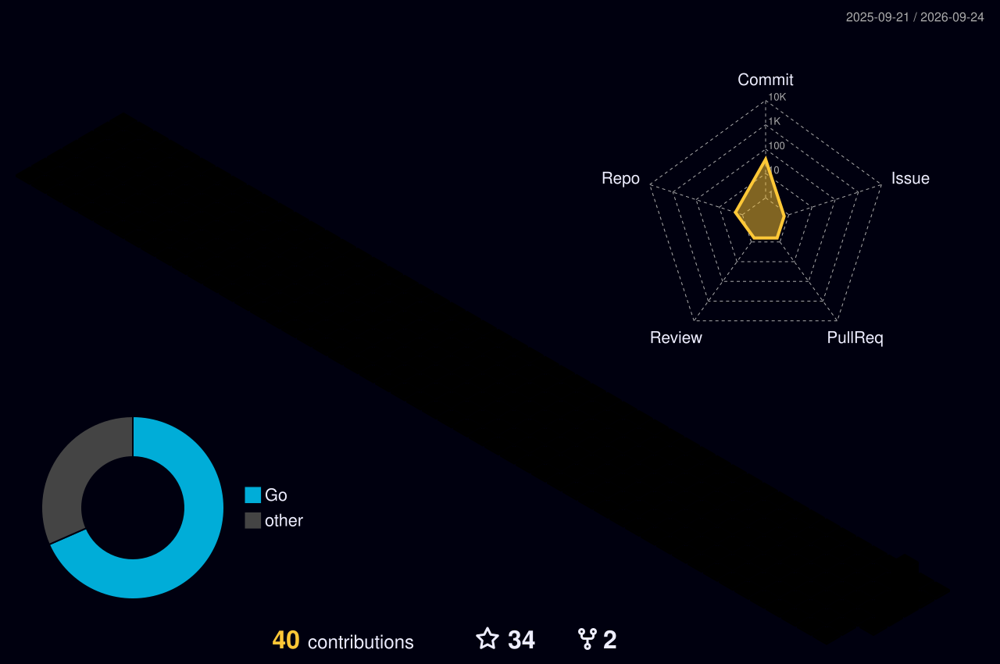

<div align="center">


<br>

# ⚡ Flecksis

### `developer • anime • code • chaos`


<br>


</div>

---

## 🧠 About me

```text
> building stuff
> learning stuff
> breaking stuff
> fixing stuff
> repeat
💻 Developer
🚀 Building projects
🎨 Interested in cool interfaces & tech
💣 Reze enjoyer
💬 Discord: flecksis
🛠️ Tech Stack
<div align="center">  </div>
📊 GitHub Stats
<div align="center">   </div> <br> <div align="center">  </div>
📈 Activity
<div align="center">  </div>
🐍 Contribution Snake
<div align="center"> <picture> <source media="(prefers-color-scheme: dark)" srcset="https://raw.githubusercontent.com/YOUR_USERNAME/YOUR_USERNAME/output/github-snake-dark.svg"> <source media="(prefers-color-scheme: light)" srcset="https://raw.githubusercontent.com/YOUR_USERNAME/YOUR_USERNAME/output/github-snake.svg">  </picture> </div>
🎧 Currently listening
<div align="center">  </div>
🧊 3D Contributions
<div align="center">  </div>
📫 Contact
<div align="center">

<br><br>

thanks for visiting 👾
</div> ```
